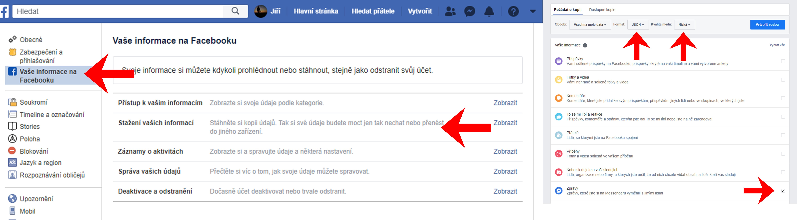

# Facebook conversations into graphs and more

Info and backstory are [here](https://manakjiri.eu/#facebook_datamining).

Usage:
* pip3 install tqdm
* python3 analyze.py -i /path/to/the/inbox/folder/ (optional: -o /path/to/an/output/folder)
* have fun
